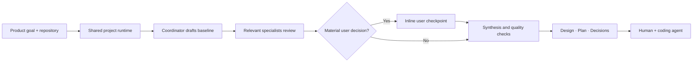

# 🚀 DesignFlow

Current release: **0.1.0**

DesignFlow is an interactive **AI Architect Dashboard and Planning Board** designed to help developers design with multiple AI agents. Instead of letting AI blindly generate codebases, DesignFlow focuses on the critical initial step: **aligning on design decisions and producing crisp, structured implementation plans** that you can feed to any AI builder (like Cursor, Codex, or Antigravity) to write the code.

## How DesignFlow works



Python owns routing, workflow state, persistence, and recovery. Models are used for specialist judgment and synthesis. Multiple users opening the same project share one runtime; when the last collaborator leaves, background work stops and the runtime closes cleanly.

See [DesignFlow Architecture](docs/ARCHITECTURE.md) for the system, workflow, context-memory, collaboration, and provider-recovery diagrams.

---

## 🏗️ Key Features

### 1. Unified Architect Dashboard

- **Split Layout View**: View `DESIGN.md` (architecture specification) and `PLAN.md` (task breakdown) side-by-side.
- **Mermaid.js Flowchart Renderer**: Automatically parses standard ` ```mermaid ` blocks from your design document and renders a visual, interactive component connections diagram on the canvas.

### 2. Conversational Agent debates & Routing

- **Direct Turn Routing**: Send a message directly to any specific agent by prefixing it with `@AgentName`.
- **Keyword-Driven Debates**: Enter prompts like `debate choosing sqlite vs postgres` to start full-team debates. Standard conversational text is routed directly to the best coordinator model.
- **Auto-Resume on Steer**: Submit a steering message in the bottom prompt bar while a run is paused; DesignFlow will automatically resume execution and alert the agents to read your input.
- **Proactive Human Checkpoints**: The coordinator agent pauses automatically (emitting a `PAUSE_FOR_INPUT` verdict) to clarify requirements and ask design choice questions.

### 3. Real-Time Connection Health Checks

- **Live Status Dots**: Next to each agent config card, a glowing status indicator displays its connection status:
  - 🔵 **Testing**: Dynamic validation in progress.
  - 🟢 **Success**: Credentials and routing verified.
  - 🔴 **Failed**: Credentials rejected (hovering shows the detailed error message).
- **Project-Scoped Agents**: Configure only the agents each project needs; credentials and routing stay local to that project.

### 4. Bounded Context & Token Optimization

- **Incremental Context**: Only sends modified file diffs since the agent's last turn.
- **USD Cost Estimation**: Live input, output, and cached token tracking per agent with automated USD expenditure calculations.
- **Sliding Window Memory**: Memory is adjusted automatically to avoid hitting provider token context limit bounds.

---

## 🛠️ Quick Start

### 1. Requirements & Run

```bash
# Clone the repository and navigate inside
cd DESIGNFLOW

# Install dependencies
python3 -m pip install -r requirements.txt

# Start the application server
python3 run.py --port 8010
```

For passive, project-local workflow diagnostics during development, start with
`python3 run.py --port 8010 --debug-observer`. The observer is disabled by default,
redacts sensitive values, and writes suggestions under `.designflow/debug/`.

Security- and state-relevant user actions are recorded by default in the server-wide
`~/.designflow/audit.db`. Audit entries contain hashed session/project identifiers and
redacted metadata; they never include passwords, provider credentials, full prompts, or
model responses. Administrators can query recent events through `GET /admin/audit` with
optional `username`, `action`, `result`, and `limit` filters. Events are retained for 90 days.

Decision checkpoints are stored as structured rows in each project's SQLite database.
Exactly one checkpoint per run may be active, option answers are validated transactionally,
and stale submissions are rejected by checkpoint ID. `QUESTIONS.md` is now only a readable
projection of the active database row and is never parsed by the server runtime.

Completed plans must include end-to-end requirement traceability from the original brief to
design coverage, bounded implementation work, and acceptance evidence. Deterministic quality
checks reject pending decisions, references to missing checkpoints, and incomplete traceability.
Export is composed from canonical server-side artifacts and is blocked until those checks and
all active decision checkpoints pass; browser-supplied export content is never authoritative.

Each project also receives an editable `.designflow/product_capabilities.json` catalog.
DesignFlow evaluates its commercial, operational, delivery, security, and experience
capabilities during discovery and synthesis. Set an entry's `mode` to `include` or
`exclude` to override automatic relevance judgment, add project-specific entries, or
remove entries that should not be considered. Existing project catalogs are never overwritten.

Open **[http://localhost:8010](http://localhost:8010)** in your browser.

### Connect coding agents over MCP

DesignFlow exposes a standard Streamable HTTP MCP server from the same process. Point any
MCP-capable coding agent at `http://127.0.0.1:8010/mcp/`:

```json
{
  "mcpServers": {
    "designflow": {
      "type": "http",
      "url": "http://127.0.0.1:8010/mcp/"
    }
  }
}
```

The MCP server exposes `get_project_status`, `read_artifact`,
`get_implementation_context`, `validate_project`, `get_recent_activity`,
`record_implementation_report`, and `list_implementation_reports`. Write-back is limited
to implementation evidence, design mismatches, and questions. Each tool takes the absolute
`project_path`, so one DesignFlow server can safely serve multiple local projects without
depending on whichever project is open in the dashboard.

MCP is localhost-only without credentials by default. An administrator can open **MCP
Servers → DesignFlow MCP Access**, generate a random bearer token, and copy it into the
client's `Authorization: Bearer <token>` header. The plaintext is displayed once; DesignFlow
stores only its SHA-256 digest. Regenerating immediately invalidates the previous generated
token, and revocation returns the server to local-only access unless an environment token
is also configured.

For unattended deployment, `DESIGNFLOW_MCP_TOKEN` remains supported. Environment and
UI-generated tokens are independent and either can authenticate. Use TLS through a trusted
reverse proxy whenever MCP traffic leaves the local machine. The dashboard's third-party
MCP server configuration API is separate at `/mcp/servers`.

### 2. Setup a Project Folder

1. Enter an absolute folder path (e.g. `/Users/you/my-project`) in the **Project Folder** bar and click **Open / Create**.
2. DesignFlow automatically generates an internal project metadata folder to store agent overrides, debate history, and a local SQLite database (`designflow.db`).

### 3. Using the VS Code Extension

You can optionally run DesignFlow directly inside VS Code as an integrated webview. 

1. Ensure the backend server is running (`python run.py --port 8010`).
2. Inside `vscode-extension/`, run `npm install` and compile with `npx vsce package`.
3. Install the resulting `.vsix` file into your local VS Code.
4. Open the Command Palette (`Cmd+Shift+P`) and type **DesignFlow: Open Dashboard**.

---

## 🗄️ Architecture & Structure

```text
designflow/
├── backend/
│   ├── agents/
│   │   ├── base.py         # Abstract AgentBase class with sliding window memory
│   │   └── providers.py    # OpenAI, Claude, Groq, Gemini, CLI (agy, codex), Ollama
│   ├── workspace/
│   │   └── workspace.py    # Directory management, file writes, and diff state
│   ├── orchestrator.py     # Main coordinator debate, planning loops, and steering
│   ├── designflow_mcp.py   # Coding-agent MCP tools and scoped project context
│   ├── storage.py          # Local SQLite session persistence
│   └── server.py           # FastAPI REST, SSE, and mounted MCP transport
├── frontend/
│   └── index.html          # Interactive dashboard (HTML5, Tailwind, Vanilla CSS, JS)
├── run.py                  # Startup script
└── requirements.txt        # Backend dependencies
```

---

## 📝 Custom Agent Providers

To register a custom LLM or API wrapper, subclass `AgentBase` and define `_raw_send`:

```python
from backend.agents.base import AgentBase, Usage

class MyCustomAgent(AgentBase):
    def _raw_send(self, messages: list[dict], system: str) -> tuple[str, Usage]:
        # Call your API/model here
        response_text = call_custom_api(system, messages)
        usage = Usage(
            input_tokens=100,
            output_tokens=len(response_text.split())
        )
        return response_text, usage

# Register with provider mapping
from backend.agents.providers import AGENT_KINDS
AGENT_KINDS["custom_provider"] = MyCustomAgent
```
