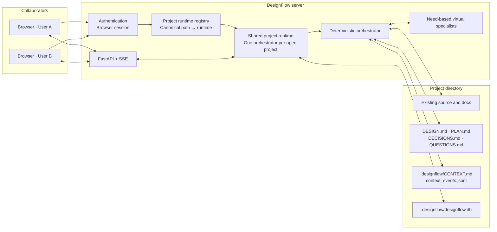
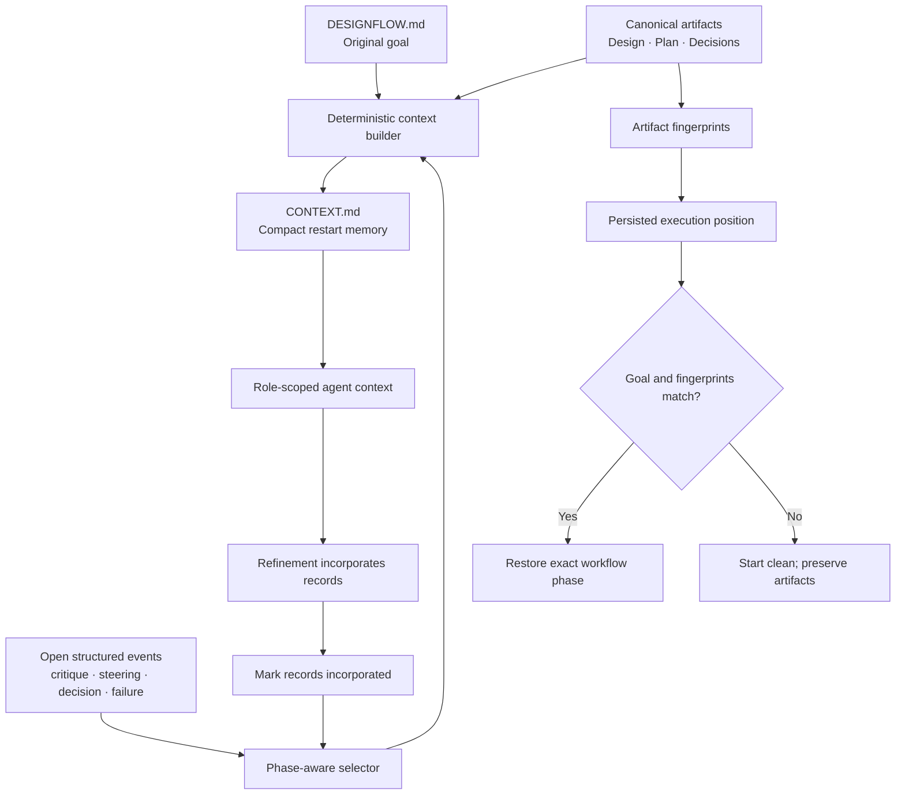
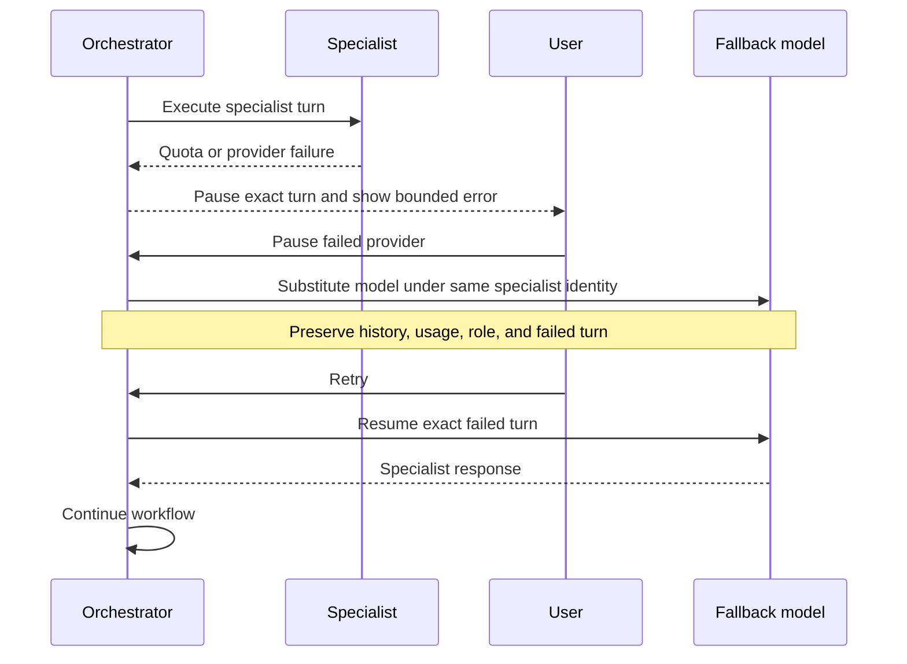

# DesignFlow Architecture

DesignFlow turns a high-level product goal and an existing repository into a reviewed planning baseline. Python owns workflow, routing, persistence, and recovery; language models contribute specialized analysis and synthesis. The result is a set of durable design artifacts that a coding agent and human team can refine during implementation.

## System and ownership model



Browser sessions identify people and select a project. They do not own the orchestration process. All collaborators attached to the same canonical project path share one runtime, event stream, agent team, and database connection. When the final collaborator leaves, DesignFlow stops the run, cancels background work, closes the database, and removes the runtime.

## Planning workflow

```mermaid
stateDiagram-v2
    direction TB
    
    %% Entry Point
    [*] --> Init: run()
    Init --> DiscoveryPhase: Start Loop (max 30 steps)

    %% Discovery
    state "Discovery Phase" as DiscoveryPhase {
        direction LR
        D1[Check Context] --> D2{Context Missing?}
        D2 -->|Yes| D3[Write Clarifying Question to QUESTIONS.md]
        D2 -->|No| D4[Skip to Drafting]
    }
    
    %% Drafting
    state "Drafting Phase" as DraftingPhase {
        direction LR
        Dr1[Find Strongest Model] --> Dr2[Coordinator Drafts Plan & Design]
        Dr2 --> Dr3[Update DESIGN.md & PLAN.md]
    }

    %% Peer Review
    state "Peer Review Phase" as PeerReviewPhase {
        direction LR
        P1[select_peer_review_agents] --> P2[Select Relevant Specialists by Keywords]
        P2 --> P3{More Peers?}
        P3 -->|Yes| P4[Peer Reads Context & Critiques]
        P4 --> P5[Log to LOGBOOK & Add Context Event]
        P5 --> P3
        P3 -->|No| P6[Done with reviews]
    }

    %% Refinement
    state "Refinement Phase" as RefinementPhase {
        direction LR
        R1[Coordinator Resolves Critiques] --> R2[Update Artifacts]
        R2 --> R3{coordinator_completion_errors()}
        R3 -->|Errors found < 3 times| R4[Inject deterministic quality_failure event]
        R3 -->|Material Decision Needed| R5[Write Checkpoint to QUESTIONS.md]
        R3 -->|Pass| R6[Done]
    }

    %% Approval
    state "Approval Phase" as ApprovalPhase {
        direction LR
        A1[Pause Run & Wait for UI] --> A2[User Input Received]
        A2 --> A3[Log User Steering Event]
        A3 --> A4[Resume Target Phase]
    }

    %% Transitions
    DiscoveryPhase --> DraftingPhase: No questions
    DiscoveryPhase --> ApprovalPhase: Needs User Input
    
    DraftingPhase --> PeerReviewPhase
    
    PeerReviewPhase --> RefinementPhase
    
    RefinementPhase --> RefinementPhase: Retry due to quality errors
    RefinementPhase --> ApprovalPhase: Decision Checkpoint needed
    RefinementPhase --> Complete: Clean pass
    
    ApprovalPhase --> DraftingPhase: (from Discovery)
    ApprovalPhase --> Complete: (from Refinement)
    
    Complete --> [*]: Baseline Finished
```

### Deeper Dive into the Mechanisms
1. **Loop Bound:** The state machine runs in a `while` loop (up to 30 steps) calling phase handlers. If it hits 30 without finishing, it throws an exception to prevent infinite AI loops.
2. **Deterministic Discovery (`_run_discovery_phase`):** Python regex checks if the goal is underspecified. If it mentions "payments" but not "compliance", Python outputs the question itself instead of burning LLM tokens to figure that out. It triggers the `ApprovalPhase`.
3. **Keyword-Heuristic Peer Review (`_run_peer_review_phase`):** Instead of broadcasting to all agents, Python looks at the goal words. If it sees "AWS" or "docker", it selects the `devops_engineer`. Each selected peer reads the coordinator's draft, writes a critique to `LOGBOOK.md`, and injects an unresolved `peer_critique` event into the active context.
4. **Deterministic Quality Gates (`_run_refinement_phase`):** The coordinator synthesizes the peer critiques. Python then checks the output for structural errors (`_coordinator_completion_errors()`). If it failed to address requirements, Python increments `_refinement_attempts` and forces the coordinator to try again *without human intervention*.
5. **Approval Resumption (`_run_approval_phase`):** A pause stops the loop. When the user responds via `/run/steer`, the steering is added as a `user_decision` context event, and the state machine resumes whatever phase was stored in `post_approval_phase`.

Questions are written to `QUESTIONS.md` for durable state and rendered inline in the main discussion window. Each checkpoint asks one material question with a small set of choices and accepts a custom response through the normal prompt input.

## Context and restart lifecycle



`CONTEXT.md` is a cache, not a source of truth. It is rebuilt locally without an LLM call. Structured context events are stored as complete records with `open`, `incorporated`, `rejected`, or `superseded` status. A phase receives only relevant open records; incorporated critiques are not repeatedly sent to models.

Routine specialists receive compact project memory plus at most two relevant canonical artifacts. The coordinator receives the complete planning set when synthesis quality requires it. The full `LOGBOOK.md` remains an audit trail and is not routine prompt context.

## Provider failure and user-controlled fallback



Fallback is never automatic. A user explicitly pauses the failed provider and retries. DesignFlow preserves the logical specialist identity, history, token accounting, and workflow position while changing the underlying model.

## Durable project data

| Data | Purpose |
| --- | --- |
| `DESIGNFLOW.md` | Original project goal or brief |
| `.designflow/DESIGN.md` | Canonical architecture and technical design |
| `.designflow/PLAN.md` | Requirements, risks, validation, and implementation phases |
| `.designflow/DECISIONS.md` | Confirmed choices and trade-offs |
| `.designflow/QUESTIONS.md` | The one active user checkpoint, if any |
| `.designflow/CONTEXT.md` | Deterministic compact restart memory |
| `.designflow/context_events.jsonl` | Lifecycle-aware unresolved context records |
| `.designflow/LOGBOOK.md` | Full audit trail, excluded from routine prompts |
| `.designflow/designflow.db` | Agents, runs, turns, usage, settings, and recovery state |

## Current collaboration boundary

Multiple users can share one project runtime, observe the same run, and steer the same agents. The current foundation does not yet provide presence indicators, project membership roles, or conflict-free simultaneous manual editing. Those are collaboration-layer additions; they do not require changing the project-owned runtime model.
