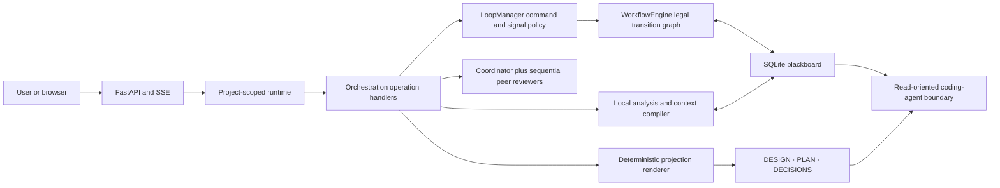
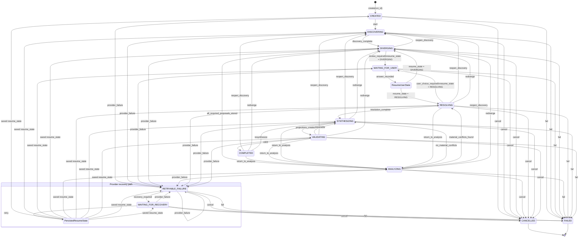
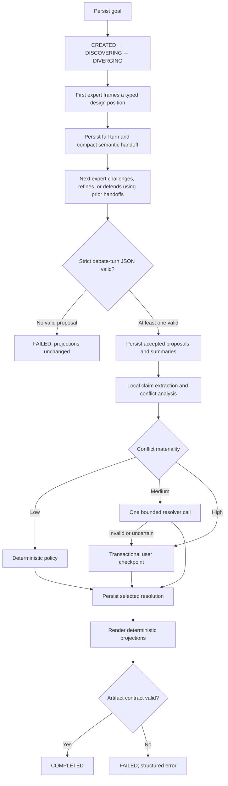
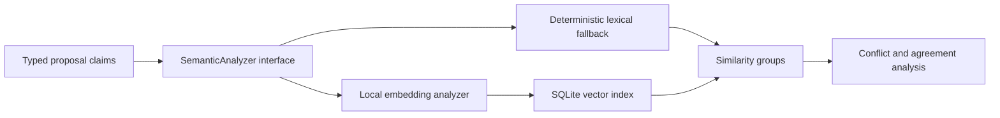

# DesignFlow Architecture

DesignFlow converts a product goal and repository context into a deterministic planning baseline. Python owns control flow, durable state, persistence, conflict policy, context limits, projection, and validation. Models participate in a bounded sequential review: opening design, grounded peer challenges, coordinator revision, then projection.

There is one orchestration implementation: `backend/orchestration.py`. SQLite is the authority for a run. `DESIGN.md`, `PLAN.md`, `DECISIONS.md`, and `QUESTIONS.md` are projections for people and coding agents; parsing those files never reconstructs workflow state.

## Ownership and trust boundaries

The boundaries are intentional:

- Models may propose typed claims. They cannot transition the workflow, mutate canonical planning rows, select arbitrary tools, or write Markdown.
- `LoopManager` is the sole phase selector. It converts each durable snapshot into one typed command and each typed operation result into one legal workflow event.
- `WorkflowEngine` accepts only declared state/event pairs. Illegal and stale transitions fail; completed workflows accept only declared corrective events.
- `WorkflowRepository` performs transactional compare-and-commit against the current state and records every accepted transition.
- The browser renders the returned `state` and `allowed_actions`; event messages are notifications, not state authority.
- MCP planning reads do not expose tools to proposal agents. MCP write-back is limited to implementation reports, mismatches, and questions.

## Authoritative workflow contract

### States

| State | Meaning | User actions |
| --- | --- | --- |
| `CREATED` | Durable run exists but has not started | cancel |
| `DISCOVERING` | A typed adequacy gate checks grounded scope, actors, outcomes, constraints, and repository evidence | cancel |
| `DIVERGING` | Persist opening → challenges → human review → coordinator dispositions and canonical revision | cancel |
| `ANALYZING` | Claims, agreement, and conflict are analyzed locally | cancel |
| `RESOLVING` | Material conflicts are being resolved | cancel |
| `WAITING_FOR_USER` | A structured decision checkpoint is active | answer, cancel |
| `SYNTHESIZING` | Accepted blackboard state is projected | cancel |
| `VALIDATING` | Deterministic artifact contracts are checked | cancel |
| `RETRYABLE_FAILURE` | A provider operation failed and retained its resume state | cancel |
| `WAITING_FOR_RECOVERY` | Explicit retry or failover is required | retry, failover, cancel |
| `COMPLETED` | Valid projections were produced | none |
| `CANCELLED` | User stopped the run | none |
| `FAILED` | Non-recoverable validation or workflow failure | none |

`CANCELLED` and `FAILED` are final. `COMPLETED` accepts only explicit corrective transitions backed by a reason; normal forward events remain illegal. Waiting states persist `resume_state`; they are not inferred from pause flags or process memory.

### Transition graph

`provider_failure`, `cancel`, and `fail` are cross-cutting events from nonterminal states. A provider failure records the interrupted state as `resume_state`. `state_version` increments on every committed transition, providing an observable monotonic version for clients.

Corrective events are append-only compensations, not state rewrites. The repository atomically records
the transition and a `workflow_invalidations` row, rejects pending checkpoints, invalidates completed
or running operations, and removes blackboard records downstream of the target phase. The prior
transition chain remains intact.

The semantic interaction router sits before this graph. Read-only `answer` interactions never create a workflow instance. Only `planning_workflow` enters at `CREATED`; `recovery` requires an existing nonterminal instance.

### Transition invariants

- Transition payloads use the JSON-object `TransitionPayload` envelope. Their required and optional
  event-specific fields are defined in the "Transition Payload Contract" section of
  `docs/STATE_MACHINE_CONTRACT.md`; the envelope itself does not imply that every event shares fields.
- Every transition has a content-derived idempotency key.
- The key excludes observed source state so a post-commit retry retains the original key; repeatable events include stable operation, conflict, checkpoint, or attempt identity in their payload.
- Replaying an already committed event returns the durable snapshot without applying it twice.
- Commit verifies the database state still equals `from_state`; a stale writer is rejected.
- Entering `WAITING_FOR_USER` requires an explicit `resume_state`.
- Answer and retry events are legal only from their corresponding waiting states.
- Failure details are structured JSON and public responses must not contain secrets.

## Planning pipeline

Every natural-language submission first enters a typed semantic interaction router. The router sees the request, durable workflow snapshot, current artifacts, and bounded repository evidence. It returns exactly one outcome: `answer`, `planning_workflow`, or `recovery`. It is explicitly instructed to classify intended outcomes rather than words or punctuation. Invalid router output fails safe to `answer`, the read-only path.

An `answer` uses one project-aware agent to explain status, decisions, gaps, or advice. It records a normal chat run and transcript but cannot write the product brief, planning blackboard, or artifacts. `planning_workflow` alone enters the pipeline below. `recovery` requires an existing nonterminal workflow. Structured UI actions may explicitly request planning; this is an interaction control, not text classification.

The coordinator first returns a strict `ExpertProposal`. Peers then return `DebateReview` records containing only grounded challenges or validated topics; they do not generate competing full proposals. Before revision, the workflow creates a durable human review checkpoint showing the proposed direction and important objections. The user may approve or provide steering; that answer is authoritative revision input. The coordinator then returns a `DebateRevision` with one `accepted`, `defended`, `merged`, or `unresolved` disposition for every challenge and one canonical revised proposal. Only that canonical proposal feeds claims and projections. Every turn is durably stored in `planning_debate_turns`; completed runs remain replay-safe.

Each proposal receives a bounded repository evidence packet, preferring root product/specification Markdown and then other indexable project files. Placeholder goals such as “just testing” are rejected before agent initialization or identity persistence. A previously persisted placeholder may be replaced by the next meaningful goal.

Conflict policy is proportional:

- Low materiality uses a deterministic choice.
- Medium materiality gets one resolver call using a bounded context packet. A response outside the allowed options becomes a user checkpoint.
- High materiality always becomes a structured user checkpoint.

Exactly one checkpoint per run is active. Its ID and options are validated transactionally. `QUESTIONS.md` is only its human-readable projection.

### Discovery contract

`DISCOVERING` is an executed gate, not a transitional label. The loop manager builds a bounded context packet and asks the coordinator for a typed `DiscoveryAssessment`. The assessment is valid only when it contains an adequacy verdict, a factual evidence summary, and up to three prioritized blocking questions.

- Architecture proposals cannot be dispatched until the assessment is adequate.
- Discovery-model uncertainty is persisted as provisional unknowns for later validation; it cannot create a user checkpoint by itself.
- Only a material conflict grounded in accepted proposals can create a durable product-decision checkpoint.
- A missing/invalid opening, review, revision, or incomplete disposition set fails the debate contract without changing planning artifacts.

## SQLite blackboard contract

The project database at `.designflow/designflow.db` owns planning truth.
Connections enable foreign-key enforcement, a five-second busy timeout, and WAL mode.

| Entity | Purpose |
| --- | --- |
| `workflow_instances` | Current state, resume state, version, active operation, and failure metadata |
| `workflow_transitions` | Append-only accepted transition history and idempotency keys |
| `workflow_invalidations` | Corrective-transition reasons and the downstream records invalidated atomically |
| `workflow_operations` | Durable provider/local operation identity and attempt status |
| `planning_goals` | Goal, constraints, and non-goals for the run |
| `expert_proposals` | Strict accepted proposal payloads and source expert identity |
| `planning_debate_turns` | Ordered opening, challenge, and revision payloads |
| `run_participants` | Durable role → provider → model roster for each run |
| `planning_claims` | Normalized claims extracted from proposals |
| `planning_conflicts` | Options, materiality, status, resolution, and resolution source |
| `context_summaries` | Content-addressed summaries with source provenance |
| `context_nodes` | Complete semantic units, structural summaries, hashes, authority, importance, and lifecycle |
| `context_edges` | Parent/child and cross-reference relationships between context nodes |
| `decision_checkpoints` | Transactional product decisions and answers |
| `semantic_embeddings` | Versioned local vector records tied to content hashes |

Legacy `planning_documents`, `planning_sections`, `planning_mutations`, serialized global `run_state`, and agent-history restoration are not orchestration authorities and have been removed.

## Local semantic analysis

Semantic analysis is a replaceable local capability, never a remote dependency or state machine.

The embedding implementation loads only an explicitly configured local model (`DESIGNFLOW_EMBEDDING_MODEL_PATH`) or an injected encoder. It never downloads a model. Vector rows record model ID, model version, dimensions, and content hash so incompatible or stale vectors cannot be silently reused. If embeddings are unavailable, the deterministic lexical analyzer preserves core functionality.

## Context compilation contract

Model context is compiled per operation by the loop manager; it is not accumulated agent chat history. Agents never receive a SQLite handle, repository, context-tree service, or permission to select their own evidence.

SQLite stores a durable semantic context tree in `context_nodes` and `context_edges`. Nodes represent complete goals, documents, Markdown sections, source files, workflow snapshots, proposals, and interaction handoffs. Each node records its parent, source reference, content hash, authority, importance, full and summary token estimates, lifecycle status, and a complete structural summary. Parent/child edges preserve document and operation hierarchy.

For each turn, the manager synchronizes changed sources by content hash, ranks candidate nodes using local embeddings with lexical fallback, adds structurally related authoritative nodes, and constructs an immutable rendered packet. Budgets operate on atomic nodes:

1. Include the complete node if it fits.
2. Otherwise include its complete persisted summary if that fits.
3. Otherwise omit the optional node.
4. Fail explicitly if a mandatory node has neither a full nor summary representation that fits.

No context path takes an arbitrary character prefix. Summaries select complete headings, list statements, declarations, or sentences and remain caches with source provenance—not planning truth.

The default conflict-resolution budget is 2,000 estimated tokens. Proposal packets use 6,000 tokens and interaction routing/answers use 3,000 tokens.

Mandatory content is always included first:

1. Product goal.
2. Constraints.
3. Confirmed decisions.
4. Instructions for the current operation.

If mandatory content itself exceeds the budget, compilation fails instead of truncating it. Optional conflicts, summaries, and raw evidence are ordered deterministically by priority, relevance, and stable ID. Items that do not fit are dropped whole. Every selected item carries source provenance and the packet reports its estimated token count.

After an agent returns, the manager validates its typed output and persists both the full evidence and a compact handoff node. Subsequent agents retrieve relevant handoffs and source nodes rather than independently reading the database or inheriting raw transcript history.

## Projection and completion contracts

The renderer reads accepted blackboard state and deterministically produces:

- `DESIGN.md`, including a Mermaid diagram, capability behavioral contracts, known unknowns and validation, and product operations/evolution.
- `PLAN.md`, including Requirements, Non-Goals, Assumptions, Alternatives, Decisions, Risks, Acceptance Criteria, Requirement Traceability, Implementation Phases, and Discovery Checkpoints. Implementation work is represented by checkable `- [ ]` tasks.
- `DECISIONS.md`, including selected recommendations, alternatives, rationale, and resolution provenance.

Models never merge Markdown sections. Rendering the same blackboard state twice must produce the same files. A malformed provider response cannot partially mutate projections. Completion occurs only after deterministic validation succeeds.

Combined exports are written under `.designflow/exports/<project-name>.md`. DesignFlow never writes an export to `<project-root>/<project-name>.md`, because that path may be a real source or product document. Product architecture diagrams are derived from accepted components and their interfaces rather than depicting DesignFlow's own orchestration internals.

## Restart, API, and UI behavior

On project open, the server queries SQLite for the latest nonterminal workflow. The public status response includes the durable workflow snapshot (`run_id`, `state`, `resume_state`, `state_version`, failure metadata, and `allowed_actions`) plus compatibility presentation fields used by the current UI.

SSE communicates that state changed; reconnecting clients fetch `/run/status` again. The frontend maps authoritative states to presentation states, including `WAITING_FOR_USER → paused`, `WAITING_FOR_RECOVERY → needs_attention`, and `COMPLETED → done`. Clients must not infer workflow authority from transcript text or local modal state.

Process-local events are used only to wake the currently running coroutine after a persisted checkpoint answer. The durable checkpoint and workflow row remain the recovery authority.

Accepted provider turns are also appended to the run-specific logbook transcript. Terminal cleanup is monotonic: logout, project release, or an idempotent stop request cannot rewrite a completed run as stopped.

## Provider and failure behavior

- Invalid expert output is isolated. Other valid expert proposals may continue; if none are valid, the workflow fails without changing planning artifacts.
- Invalid medium-conflict resolution escalates to the user rather than selecting an unsupported answer.
- Provider recovery states and retry/failover actions are represented in the state model. Provider adapters must preserve the logical operation and resume state when wiring those actions.
- Cancellation is legal from every nonterminal state and produces `CANCELLED`.
- Sensitive values are never recommended for logging. Audit metadata is redacted, credentials are encrypted at rest where stored, and errors are bounded before reaching clients.

## Coding-agent MCP boundary

The FastAPI process mounts Streamable HTTP MCP at `/mcp/`. Every project tool takes an explicit absolute `project_path`; it never inherits the browser's selected project. With no token, access is localhost-only. Generated and environment bearer tokens are supported for remote clients, and TLS must terminate before remote traffic reaches DesignFlow.

Coding agents may read status, validated artifacts, scoped implementation context, and recent activity. Write-back is limited to implementation evidence, design mismatches, and questions. They cannot modify workflow transitions, accepted proposals, confirmed decisions, or planning projections.

## Current limitations

- Local embeddings require a compatible model already present on disk; lexical analysis is the default fallback.
- State-level UI mapping has unit coverage, but full browser automation across every durable state remains future work.
- Provider retry/failover states are modeled; end-to-end behavior still depends on each provider adapter exposing a recoverable failure classification.
- The current runtime coordinates one active planning run per project and does not provide conflict-free simultaneous manual artifact editing.
