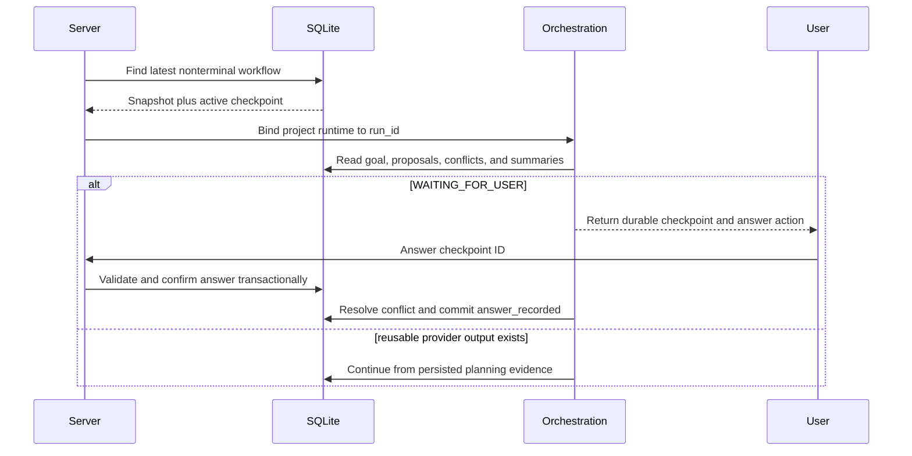

# Core Workflow Recovery Contract

This document defines the recovery and replay guarantees of the current single orchestration engine. SQLite state is authoritative; process memory, SSE history, model chat history, and generated Markdown are not recovery inputs.

## Recovery invariants

| Invariant | Enforcement | Test evidence |
| --- | --- | --- |
| Goal identity is durable | `planning_goals` is written before provider work | Restart reloads the same goal |
| State is explicit | `workflow_instances.state`, `resume_state`, and `state_version` | Legal/illegal transition tests |
| Transitions are replay-safe | Content-derived idempotency key plus unique durable transition | Duplicate event does not advance twice |
| Writes reject stale actors | Compare current database state with `from_state` in one transaction | Stale transition fails |
| Provider work is reusable | Accepted typed proposals and summaries persist before analysis | Restart reuses proposals without provider calls |
| Operations close truthfully | Successful proposal dispatch clears `active_operation_id` and records completion time | Completed run has no running operation |
| Waiting is durable | Workflow row and active checkpoint are committed before notifying clients | Checkpoint survives store/runtime restart |
| Answers are unambiguous | One active checkpoint; ID and option validated transactionally | Stale/invalid answer is rejected |
| Failure is atomic | Invalid outputs cannot mutate accepted planning projections | Original artifacts remain unchanged |
| Completion is replay-safe | Terminal state blocks new transitions; completed run returns projections | Rerun performs zero provider calls |
| Terminal outcome is monotonic | Cleanup does not rewrite completed runs or append a second stopped result | Logout/stop after completion preserves done |
| UI is reconstructable | `/run/status` returns workflow snapshot and allowed actions | Refresh does not depend on SSE replay |

## Restart sequence

## Failure classes

- **Invalid proposal:** discard that proposal. Continue if another valid proposal exists; otherwise transition to `FAILED` with `no_valid_proposals`.
- **Invalid resolver output:** create a user checkpoint. Never invent or silently coerce a choice.
- **Projection contract failure:** transition to `FAILED` with structured validation errors. Do not report completion.
- **Recoverable provider failure:** transition through `RETRYABLE_FAILURE` to `WAITING_FOR_RECOVERY`, retaining the interrupted `resume_state`.
- **Non-recoverable internal failure:** transition to `FAILED` with a bounded public error and detailed redacted local evidence.
- **User stop:** commit `CANCELLED` and wake any process-local waiter so the task exits.

## Required regression journey

The deterministic fake-agent suite must verify:

1. Create a temporary project and persist a goal.
2. Produce strict proposals from multiple experts and persist them before analysis.
3. Extract claims and resolve low-, medium-, and high-materiality conflicts according to policy.
4. Persist a structured checkpoint, close the original store/runtime, and recover it.
5. Reject stale checkpoint submissions and confirm a valid answer transactionally.
6. Render valid design, plan, and decision projections from accepted blackboard state.
7. Restart a completed run and prove no provider is called again.
8. Inject malformed provider output and prove existing artifacts do not change.
9. Query `/run/status` and verify the durable workflow shape and allowed actions.
10. Exercise MCP access boundaries without exposing MCP tools to planning experts.

## Readiness gate

- All repository tests pass with zero skipped orchestration tests.
- Python compilation, frontend JavaScript syntax, and patch hygiene checks pass.
- Restart, checkpoint, idempotency, invalid-output, projection, API-state, and MCP-boundary tests remain mandatory.
- A live smoke run with configured providers is performed before relying on provider-specific retry/failover behavior.
