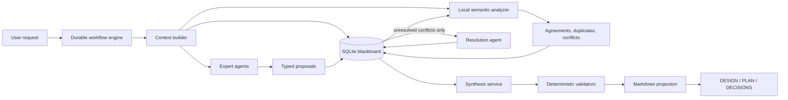

# DesignFlow Orchestration Redesign — Historical Implementation Plan

Status: Implemented. This is retained as design history, not as the runtime contract.

The current contracts are documented in [ARCHITECTURE.md](ARCHITECTURE.md) and
[CORE_WORKFLOW_RECOVERY.md](CORE_WORKFLOW_RECOVERY.md). “V2” in the filename identifies
the redesign effort only; there is no V2 engine or compatibility path. The sole runtime
implementation is `backend/orchestration.py`.

## Objective

Redesign DesignFlow's planning workflow around four foundations:

1. A durable, explicit state machine.
2. A typed SQLite blackboard.
3. Local semantic analysis.
4. Bounded, summarized context packets.

Markdown artifacts become deterministic projections of structured planning state. They are not orchestration state and are not directly merged by agents.

This is a pre-release redesign. There is no requirement to preserve the current database schema, resume old runs, maintain two workflow engines, or migrate incomplete planning state. Existing code may be replaced directly when the new contract is covered by tests.

## Target Architecture



## Architectural Rules

- The workflow state in SQLite is authoritative.
- Agents create proposals; they do not mutate canonical planning state or Markdown.
- State transitions are explicit, transactional, idempotent, and recoverable.
- Raw model responses are retained for traceability, but normal agent context uses typed summaries.
- Confirmed decisions and user constraints can never be removed by context compaction.
- Local semantic analysis proposes matches and conflicts; it does not silently make product decisions.
- LLM conflict resolution is used only for material conflicts that deterministic analysis cannot resolve.
- DESIGN.md, PLAN.md, and DECISIONS.md are reproducible projections of the blackboard.

## Phase 0 - Define the New Contract and Delete the Wrong Abstractions

Do not preserve current behavior merely because it exists. Retain only user-visible capabilities that still belong in the product.

- [ ] Write one deterministic end-to-end fixture for the desired workflow: discover, diverge, analyze locally, resolve only real conflicts, synthesize, validate, and complete.
- [ ] Define the public run-state response and SSE notification contract from the new state model.
- [ ] Define typed expert proposal, conflict, decision, summary, and projection contracts.
- [ ] Define measurable targets for provider calls, context tokens, elapsed time, deterministic validation, and crash recovery.
- [ ] Mark section merging, serialized `run_state`, agent-history restoration, pause flags, and `post_approval_phase` for immediate removal.
- [ ] Remove tests that enforce obsolete internal behavior and replace them with tests of the new product contract.
- [ ] Use a fresh development database for the new schema. Old incomplete runs and planning-section rows are disposable.

Acceptance criteria:

- One executable journey describes the intended product behavior without relying on the current orchestrator.
- Every new persisted entity has a typed contract and ownership boundary.
- No constraint exists solely to keep an unreleased internal implementation compatible.

Primary files:

- `backend/orchestrator.py`
- `backend/server.py`
- `backend/storage.py`
- `tests/test_sessions.py`
- `tests/test_journeys.py`

## Phase 1 - Introduce an Explicit Durable Workflow State

### States

```text
CREATED
DISCOVERING
WAITING_FOR_USER
DIVERGING
ANALYZING
RESOLVING
SYNTHESIZING
VALIDATING
COMPLETED

RETRYABLE_FAILURE
WAITING_FOR_RECOVERY
CANCELLED
FAILED
```

`WAITING_FOR_USER` and `WAITING_FOR_RECOVERY` are durable states, not combinations of phases, pause flags, checkpoints, and in-memory events.

### Transition Contract

| Current state | Event | Next state |
|---|---|---|
| `CREATED` | `start` | `DISCOVERING` |
| `DISCOVERING` | `question_required` | `WAITING_FOR_USER` |
| `DISCOVERING` | `discovery_complete` | `DIVERGING` |
| `WAITING_FOR_USER` | `answer_recorded` | persisted `resume_state` |
| `DIVERGING` | `all_required_proposals_stored` | `ANALYZING` |
| `ANALYZING` | `no_material_conflicts` | `SYNTHESIZING` |
| `ANALYZING` | `material_conflicts_found` | `RESOLVING` |
| `RESOLVING` | `resolution_complete` | `SYNTHESIZING` |
| `RESOLVING` | `user_choice_required` | `WAITING_FOR_USER` |
| `SYNTHESIZING` | `projections_created` | `VALIDATING` |
| `VALIDATING` | `valid` | `COMPLETED` |
| `VALIDATING` | `repairable` | `SYNTHESIZING` |
| Any active state | `provider_failure` | `RETRYABLE_FAILURE` |
| `RETRYABLE_FAILURE` | `recovery_required` | `WAITING_FOR_RECOVERY` |
| `WAITING_FOR_RECOVERY` | `retry` | persisted `resume_state` |
| Any nonterminal state | `cancel` | `CANCELLED` |

Every transition must:

- Validate its legal predecessor.
- Execute in one SQLite transaction.
- Record the triggering event.
- Store `resume_state` when entering a waiting state.
- Carry an idempotency key.
- Return the committed durable state.
- Emit UI events only after commit.

### Workflow Schema

```sql
CREATE TABLE workflow_instances (
    run_id TEXT PRIMARY KEY,
    state TEXT NOT NULL,
    resume_state TEXT,
    state_version INTEGER NOT NULL DEFAULT 1,
    active_operation_id TEXT,
    created_at TEXT NOT NULL,
    updated_at TEXT NOT NULL,
    completed_at TEXT,
    failure_code TEXT,
    failure_detail_json TEXT NOT NULL DEFAULT '{}'
);

CREATE TABLE workflow_transitions (
    id INTEGER PRIMARY KEY AUTOINCREMENT,
    run_id TEXT NOT NULL,
    from_state TEXT NOT NULL,
    event TEXT NOT NULL,
    to_state TEXT NOT NULL,
    idempotency_key TEXT NOT NULL,
    payload_json TEXT NOT NULL DEFAULT '{}',
    created_at TEXT NOT NULL,
    UNIQUE(run_id, idempotency_key)
);

CREATE TABLE workflow_operations (
    id TEXT PRIMARY KEY,
    run_id TEXT NOT NULL,
    operation_type TEXT NOT NULL,
    state TEXT NOT NULL,
    status TEXT NOT NULL,
    attempt INTEGER NOT NULL DEFAULT 1,
    input_ref TEXT,
    output_ref TEXT,
    error_json TEXT NOT NULL DEFAULT '{}',
    started_at TEXT,
    completed_at TEXT
);
```

Suggested implementation structure:

```text
backend/workflow/
    states.py
    transitions.py
    engine.py
    handlers.py
    repository.py
```

Current orchestration authority to remove during this phase:

- `post_approval_phase`
- `_paused`
- `_failed_turn`
- `_recovery_event`
- global `key_value["run_state"]`
- the arbitrary 30-step orchestration loop

Acceptance criteria:

- Invalid transitions are rejected deterministically.
- Repeating an event with the same idempotency key does not repeat work.
- Restart reconstructs the exact state entirely from SQLite.
- Workflow state does not depend on process memory or agent history.

## Phase 2 - Make SQLite a Typed Blackboard

Remove `planning_sections`, `planning_documents`, and `planning_mutations` from the canonical design. Markdown fragments are not blackboard entities.

### Blackboard Schema

```sql
CREATE TABLE planning_goals (
    run_id TEXT PRIMARY KEY,
    goal TEXT NOT NULL,
    constraints_json TEXT NOT NULL DEFAULT '[]',
    non_goals_json TEXT NOT NULL DEFAULT '[]',
    updated_at TEXT NOT NULL
);

CREATE TABLE expert_proposals (
    id TEXT PRIMARY KEY,
    run_id TEXT NOT NULL,
    operation_id TEXT NOT NULL,
    expert_id TEXT NOT NULL,
    perspective TEXT NOT NULL,
    round INTEGER NOT NULL,
    status TEXT NOT NULL,
    proposal_json TEXT NOT NULL,
    raw_response TEXT,
    created_at TEXT NOT NULL,
    UNIQUE(run_id, operation_id, expert_id)
);

CREATE TABLE planning_claims (
    id TEXT PRIMARY KEY,
    run_id TEXT NOT NULL,
    proposal_id TEXT NOT NULL,
    claim_type TEXT NOT NULL,
    topic TEXT NOT NULL,
    normalized_text TEXT NOT NULL,
    confidence REAL,
    status TEXT NOT NULL,
    created_at TEXT NOT NULL
);

CREATE TABLE planning_conflicts (
    id TEXT PRIMARY KEY,
    run_id TEXT NOT NULL,
    topic TEXT NOT NULL,
    status TEXT NOT NULL,
    materiality TEXT NOT NULL,
    options_json TEXT NOT NULL,
    resolution TEXT,
    resolution_source TEXT,
    created_at TEXT NOT NULL,
    resolved_at TEXT
);

CREATE TABLE context_summaries (
    id TEXT PRIMARY KEY,
    run_id TEXT NOT NULL,
    source_type TEXT NOT NULL,
    source_id TEXT NOT NULL,
    summary_type TEXT NOT NULL,
    summary_json TEXT NOT NULL,
    content_hash TEXT NOT NULL,
    created_at TEXT NOT NULL,
    UNIQUE(source_type, source_id, summary_type, content_hash)
);
```

Link conflicts to the existing decision system:

```sql
ALTER TABLE decisions ADD COLUMN conflict_id TEXT;
ALTER TABLE decision_checkpoints ADD COLUMN conflict_id TEXT;
```

### Expert Proposal Contract

```json
{
  "components": [
    {
      "name": "string",
      "responsibility": "string",
      "interfaces": ["string"]
    }
  ],
  "decisions": [
    {
      "topic": "string",
      "recommendation": "string",
      "rationale": "string",
      "alternatives": ["string"]
    }
  ],
  "risks": [
    {
      "risk": "string",
      "mitigation": "string"
    }
  ],
  "assumptions": ["string"],
  "unknowns": [
    {
      "question": "string",
      "validation": "string"
    }
  ]
}
```

Invalid proposal JSON fails the operation and never mutates canonical state.

Acceptance criteria:

- Agents only create proposals.
- Workflow handlers alone accept, reject, cluster, and resolve claims.
- Agents cannot directly edit DESIGN.md, PLAN.md, or DECISIONS.md.
- Every projected statement is traceable to a proposal, decision, user directive, or engineering invariant.

## Phase 3 - Add Local Semantic Analysis

### Interface

```python
class SemanticAnalyzer:
    def embed(self, texts: list[str]) -> list[list[float]]: ...
    def similar(self, left: str, right: str) -> float: ...
    def cluster(self, claims: list[Claim]) -> list[ClaimCluster]: ...
    def retrieve(self, query: str, limit: int, filters: dict) -> list[Match]: ...
```

Suggested structure:

```text
backend/semantic/
    interface.py
    local_embeddings.py
    index.py
    clustering.py
    calibration.py
```

Initial uses:

- Detect duplicate proposals.
- Cluster supporting claims.
- Generate conflict candidates.
- Retrieve relevant decisions and summaries.
- Generate candidates for contradictions with accepted decisions.

Semantic similarity is candidate generation, not an authoritative decision. Highly similar sentences can still have opposite lifecycle behavior. Processing must therefore be:

1. Generate candidates using embeddings.
2. Compare typed fields deterministically.
3. Record ambiguous pairs as conflicts.
4. Route only material unresolved conflicts to an LLM or user.

Start with ordinary SQLite embedding blobs behind an index interface. Add `sqlite-vec` only after packaging, security, compatibility, and performance are verified.

### Calibration Dataset

- [ ] Create 100-200 labeled claim pairs.
- [ ] Include paraphrases, related-but-distinct claims, contradictions, unrelated claims, and lifecycle differences.
- [ ] Measure precision and recall at multiple thresholds.
- [ ] Select thresholds from project evidence rather than adopting a fixed value.
- [ ] Store embedding model name, version, and vector dimensions with every embedding batch.

Acceptance criteria:

- High-confidence duplicates are detected locally.
- Contradictions are not silently merged.
- Analyzer unavailability degrades to deterministic string/topic matching.
- Embedding and retrieval require no remote provider call.

## Phase 4 - Compile Bounded Context Packets

Replace keyword-ranked Markdown retrieval and growing conversation history with typed packets.

Suggested structure:

```text
backend/context/
    models.py
    compiler.py
    budget.py
    summarizer.py
```

### Packet Contract

```json
{
  "goal": "string",
  "constraints": [],
  "confirmed_decisions": [],
  "relevant_assumptions": [],
  "relevant_prior_claims": [],
  "unresolved_conflicts": [],
  "role_instructions": {},
  "output_schema": {},
  "provenance": []
}
```

### Fixed Budget Priority

1. Goal and explicit user constraints.
2. Confirmed decisions.
3. Current operation instructions.
4. Relevant unresolved conflicts.
5. Semantically retrieved summaries.
6. Selected raw evidence only when required.

Goal, constraints, and confirmed decisions must never be removed to meet a context limit.

### Summary Lifecycle

- Preserve raw provider responses for traceability.
- Generate a typed summary after proposal validation.
- Hash the source content.
- Reuse the summary while the source hash is unchanged.
- Summarize summaries only at an explicit compaction boundary.
- Preserve provenance through every compaction.
- Use stateless planning calls by default.
- Do not restore full chat history into expert calls.

Acceptance criteria:

- Context size remains bounded as rounds increase.
- Later rounds do not receive full earlier transcripts.
- Every included context item records its source and retrieval reason.
- Tests prove confirmed decisions survive all compaction paths.

## Phase 5 - Implement Bounded Workflow Handlers

Required handlers:

```text
discover_requirements
dispatch_expert_proposals
analyze_proposals
resolve_conflicts
synthesize_projections
validate_projections
request_user_decision
recover_operation
```

### Divergence

- [ ] Select three relevant perspectives by default.
- [ ] Execute experts as an ordered debate; persist each typed turn and compact handoff before dispatching the next expert.
- [ ] Persist each valid proposal immediately.
- [ ] Define an explicit success quorum.
- [ ] Prevent partial or malformed responses from changing accepted state.

### Analysis

- [ ] Extract typed claims from validated proposals.
- [ ] Retrieve related confirmed decisions.
- [ ] Cluster duplicates and supporting claims.
- [ ] Create explicit conflict rows.
- [ ] Assign materiality deterministically where possible.

### Resolution

- [ ] Resolve structural duplicates locally.
- [ ] Ask a resolution model only about remaining material conflicts.
- [ ] Route product-changing choices to a user checkpoint.
- [ ] Record every resolution and its source.

### Synthesis

- [ ] Read only accepted blackboard state.
- [ ] Produce typed document models.
- [ ] Render Markdown through owned templates.
- [ ] Prohibit direct model-authored H2 section merges.

### Validation

Separate validation into:

- Typed model validation.
- Cross-reference and traceability validation.
- Engineering invariant validation.
- Markdown rendering validation.
- Mermaid syntax validation.

A formatting failure repairs or rerenders the affected projection. It must not restart the debate or erase blackboard state.

## Phase 6 - Generate Deterministic Markdown Projections

Suggested structure:

```text
backend/projections/
    design.py
    plan.py
    decisions.py
    templates/
```

The projection layer owns required headings. `PLAN.md` always renders:

```text
Requirements
Non-Goals
Assumptions
Alternatives
Decisions
Risks
Acceptance Criteria
Requirement Traceability
Implementation Phases
Discovery Checkpoints
```

Implementation tasks are typed records rendered as checkboxes, rather than inferred from model prose.

Acceptance criteria:

- Rendering identical blackboard state twice produces identical files.
- Required headings cannot disappear.
- Markdown edits cannot mutate the blackboard without an explicit import workflow.
- Section deletion caused by partial model updates becomes structurally impossible.

## Phase 7 - Clarify API and UI State

Expose one authoritative run-state response:

```json
{
  "run_id": "string",
  "state": "ANALYZING",
  "resume_state": null,
  "active_operation": {
    "type": "analyze_proposals",
    "attempt": 1
  },
  "progress": {
    "completed": 2,
    "total": 3
  },
  "waiting_for": null,
  "allowed_actions": ["cancel"]
}
```

The frontend renders from `state` and `allowed_actions`, not inferred event text.

- `WAITING_FOR_USER`: show the decision modal.
- `WAITING_FOR_RECOVERY`: show retry, failover, and stop actions.
- `RETRYABLE_FAILURE`: show the failure transition in progress.
- `COMPLETED`: show generated artifacts.
- `FAILED`: show the terminal failure and diagnostic reference.

SSE remains a notification channel. After reconnect or a replay gap, the client fetches the durable state.

Acceptance criteria:

- Refresh produces the same state and allowed actions.
- Multiple browser clients display the same state.
- Stale clients cannot answer old checkpoints or retry completed operations.

## Phase 8 - Direct Cutover and Simplification

There is one workflow engine and one schema. Replace the current implementation directly after the new end-to-end journey passes.

- [ ] Remove the old orchestration loop and phase handlers.
- [ ] Remove section-level planning storage and model-authored Markdown merging.
- [ ] Remove the global serialized `run_state` record.
- [ ] Remove planning-agent chat-history restoration.
- [ ] Remove keyword-only planning-context selection.
- [ ] Remove obsolete recovery flags and duplicate server-side status inference.
- [ ] Delete prompts, tests, and UI branches that exist only for the old workflow.
- [ ] Reset development project databases to the new schema.
- [ ] Run the complete state, blackboard, semantic, context, projection, and recovery test matrix.
- [ ] Exercise several real product ideas and inspect decisions, conflicts, artifacts, call counts, token use, and resume behavior.

Acceptance criteria:

- Only the new workflow engine is reachable.
- Only the typed blackboard is authoritative.
- There is one source of truth for run state.
- No production code reads or writes planning-section state.
- No compatibility path or workflow feature flag remains.
- Real planning runs complete with clearer state, fewer unnecessary model calls, bounded context, and deterministic artifacts.

## Required Test Matrix

### State Machine

- [ ] Every legal transition.
- [ ] Every illegal transition.
- [ ] Duplicate transition/idempotency replay.
- [ ] Crash before and after transition commit.
- [ ] Resume from every nonterminal state.
- [ ] Cancellation from every active state.

### Blackboard

- [ ] Duplicate expert submissions.
- [ ] Partial provider success.
- [ ] Conflicting proposal IDs.
- [ ] Decision supersession.
- [ ] Concurrent proposal writes.
- [ ] Projection-to-source traceability.

### Semantic Analysis

- [ ] Paraphrase detection.
- [ ] False-friend similarity.
- [ ] Direct contradictions.
- [ ] Threshold calibration.
- [ ] Missing local model fallback.
- [ ] Embedding model version change.

### Context Compilation

- [ ] Hard token limits.
- [ ] Mandatory-information preservation.
- [ ] Role-specific retrieval.
- [ ] Summary invalidation after source changes.
- [ ] Stable packet generation.
- [ ] Sensitive-field leakage prevention.

### Projection

- [ ] Every required heading.
- [ ] Checklist rendering.
- [ ] Mermaid presence and syntax.
- [ ] Capability contract rendering.
- [ ] Deterministic repeated output.
- [ ] Safe handling of redaction language.

### Recovery

- [ ] Provider rate limit.
- [ ] Quota exhaustion.
- [ ] Timeout after provider completion but before persistence.
- [ ] Process termination after persistence but before event delivery.
- [ ] SQLite lock.
- [ ] Corrupt provider JSON.
- [ ] Duplicate user answer.
- [ ] Browser reconnect during every waiting state.

## Execution Order

1. Durable workflow tables and transition engine.
2. State API and UI state rendering.
3. Typed proposals and blackboard repositories.
4. Stateless expert dispatch and context packets.
5. Deterministic projection layer.
6. Local semantic interface and calibration dataset.
7. Local duplicate, agreement, and conflict analysis.
8. Conflict-only resolution calls.
9. Direct integration through the server and UI.
10. Delete the old workflow and run full-system verification.

## Implementation Discipline

Do not begin by adding embeddings to the existing orchestration loop. First make workflow state and the typed blackboard trustworthy. Local semantic analysis must operate as a bounded service over reliable structured data, not become another hidden state mechanism inside the current loop.
