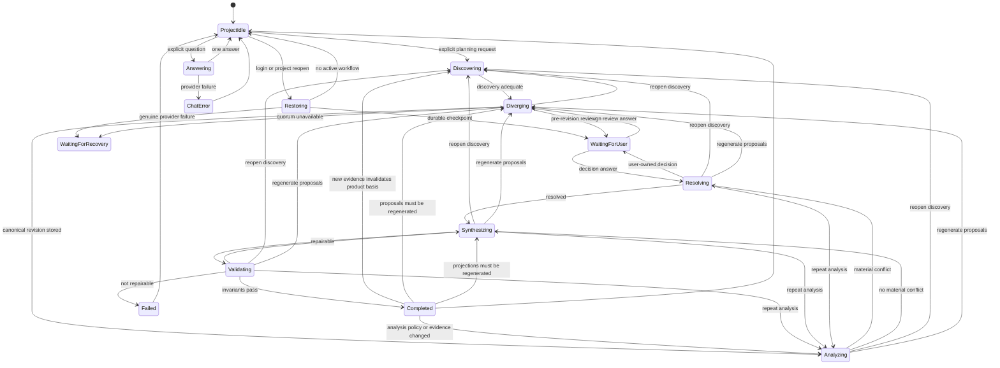

# DesignFlow State and Presentation Contract

This document is the authoritative behavioral baseline for the runtime. State names are not UI messages and persisted context is not user intent.

## State Authorities

| Concern | Authority | Invariant |
|---|---|---|
| Current user intent | The non-empty prompt submitted for this action | Stored briefs and prior goals may supply context but cannot start work |
| Planning position | `workflow_instances` plus `workflow_transitions` | Exactly one legal durable state exists per planning run |
| User decision wait | Active `decision_checkpoints` row | `WAITING_FOR_USER` has exactly one active checkpoint |
| Provider recovery | Unresolved `system_recovery_actions` row | Recovery UI appears only for a genuine recoverable provider failure |
| Conversation | User prompts and user-facing answers | Telemetry never becomes a conversation message |
| Process status | In-memory task and session binding | Process loss cannot redefine a durable checkpoint as failure |

## Workflow Contract

The loop manager is the sole next-step authority. It converts the durable workflow snapshot and
transition graph into exactly one typed command or an explicit wait, then converts each typed
operation result into one legal event. Operation handlers may inspect pending operations,
checkpoints, accepted evidence, artifact validity, and failure state, but they return those facts as
typed signals rather than choosing transitions. Agents supply typed evidence and recommendations;
they never choose or write workflow state.

Corrective movement is append-only. The manager may return to an earlier phase through a named
transition such as `REOPEN_DISCOVERY`, `REDIVERGE`, `RETURN_TO_ANALYSIS`, or `RESYNTHESIZE`. Such a
transition records its reason and evidence, invalidates dependent downstream operations and
projections, increments the state version, and preserves the prior transition history. State rows and
history are never rewritten to simulate rollback.

Before selecting a command, the manager must query the state engine for the transitions legal from
the current state. A requested transition that is not in that set is an internal invariant failure;
it must not become a user question. `COMPLETED` may be reopened only when new evidence invalidates an
accepted assumption or artifact. `CANCELLED` remains final. `FAILED` may start a recorded recovery or
replacement workflow, but cannot silently resume.

Discovery is a sufficiency gate, not a questionnaire. Ordinary product language is evidence: a
personal tool establishes its primary actor, and an explicit action plus outcome is enough to begin
design. Omitted details become visible, reversible provisional assumptions unless they change a core
capability, trust boundary, data ownership, irreversible commitment, or acceptance criterion. Only
those material unknowns may pause the workflow for user input.

Each project database permits exactly one nonterminal workflow. A partial unique SQLite index is the
authoritative enforcement point. When opening an older database that contains competing nonterminal
workflows, DesignFlow preserves the most recently updated workflow and cancels stale workflows,
their unanswered checkpoints, and their running operations in the same schema transaction.

The nonblocking discovery contract is versioned. On the first open after adopting version 3,
legacy workflows waiting on discovery questions are cancelled and their unanswered checkpoints are
rejected; they are not replayed under semantics that no longer consider those questions valid.

### Transition Payload Contract

`TransitionPayload` is a root JSON-object envelope (`dict[str, JsonValue]`), not a single structure
whose fields apply to every event. It rejects lists, scalar roots, non-JSON objects, and other values
that cannot be canonically hashed and persisted. The state engine then applies these event-specific
requirements:

| Event | Required fields | Optional fields | Meaning |
|---|---|---|---|
| `start` | none | `goal`, `source` | Begins a created workflow using an already-persisted goal |
| `question_required` | `resume_state` | `checkpoint_id`, `question_id`, `assessment` | Pauses discovery and records the exact state to resume |
| `discovery_complete` | none | `source`, `evidence_summary` | Records why discovery is adequate |
| `answer_recorded` | none | `checkpoint_id`, `question_id`, `conflict_id`, `phase` | Resumes from the durable `resume_state`; the checkpoint answer is stored separately |
| `all_required_proposals_stored` | none | `operation_id`, `accepted`, `requested` | Records proposal quorum evidence |
| `review_required` | `resume_state`, `checkpoint_id` | none | Pauses `DIVERGING` for human review before canonical revision |
| `no_material_conflicts` | none | none | Advances deterministic analysis |
| `material_conflicts_found` | none | `conflict_ids` | References conflicts already persisted in the blackboard |
| `user_choice_required` | `resume_state` | `checkpoint_id`, `conflict_id` | Pauses resolution for a material user-owned decision |
| `resolution_complete` | none | `conflicts` | Records the number of considered conflicts |
| `projections_created` | none | `files` | References generated artifact projections |
| `valid` | none | none | Records successful deterministic validation |
| `repairable` | none | `errors` | Returns validation to synthesis with bounded diagnostics |
| `provider_failure` | none | `failure_code`, `failure_detail` | Preserves structured failure metadata and the interrupted state |
| `recovery_required` | none | recovery references | Moves a retryable failure to an explicit recovery wait |
| `retry` | none | recovery references | Resumes the persisted interrupted state |
| `cancel` | none | `source` | Records who or what cancelled the workflow |
| `fail` | none | `failure_code`, `failure_detail` | Records a non-recoverable structured failure |
| `reopen_discovery` | `reason` | `evidence_refs` | Invalidates all downstream planning state and reopens discovery |
| `rediverge` | `reason` | `evidence_refs` | Invalidates proposals and all downstream state |
| `return_to_analysis` | `reason` | `evidence_refs` | Invalidates claims, conflicts, operations, and projections |
| `resynthesize` | `reason` | `evidence_refs` | Invalidates generated projections and validation results |

Corrective events are additionally validated by `CorrectiveTransitionPayload`: `reason` is required,
trimmed, and cannot be blank; optional `evidence_refs` cannot contain blank identifiers; unknown
corrective fields are rejected. `resume_state` must name a `WorkflowState`. Identifier arrays,
counts, filenames, and failure details must remain JSON values. Transition payloads are durable
internal evidence: they are excluded from logs and must never contain credentials, provider secrets,
authentication tokens, or unrestricted conversation text.

## Presentation Contract

| Runtime occurrence | Conversation rendering | Other rendering |
|---|---|---|
| User prompt | Exactly one message, before its response | None |
| Chat answer | Exactly one message | Metrics may update silently |
| Planning checkpoint | Not a chat replay | Exactly one actionable checkpoint panel |
| Genuine error | Exactly one concise error | Recovery controls only when actionable |
| Phase, turn start, retry bookkeeping, completion envelope | Never | Diagnostics/activity inspector only |
| Login with durable checkpoint | No phase replay and no synthetic failure | Restore the checkpoint once |
| Login with completed chat history | Restore prompt/answer pairs in chronological order | None |

## Completion and Recovery Invariants

- Empty input cannot create or resume a run.
- A saved brief, prior goal, or canonical artifact cannot authorize a new run.
- Discovery agents may record unknowns and provisional assumptions but cannot create user checkpoints.
- Only a material conflict grounded in accepted proposals may pause planning for product input.
- Planning cannot complete below ordered debate quorum or with an active checkpoint.
- Debate turns execute sequentially. Each accepted turn is persisted before the next agent receives a compact semantic handoff.
- `DIVERGING` is a strict opening → challenge review(s) → coordinator revision sequence. Reviewers cannot submit independent full proposals.
- After opening and peer challenges, `review_required` moves the workflow to `WAITING_FOR_USER` with `resume_state=DIVERGING`. Approval or free-form steering is durable and is authoritative input to the coordinator revision.
- Every challenge receives exactly one coordinator disposition: `accepted`, `defended`, `merged`, or `unresolved`.
- Only the coordinator revision is canonical and only one final coordinator verdict is user-visible. Internal opening/review outputs remain durable but are not dumped into chat.
- Only an unresolved material challenge can become a product-decision checkpoint.
- The pre-revision design review is always required for a planning run; later decision checkpoints remain limited to unresolved material choices.
- Parallel provider calls may be used for read-only health checks, never as a substitute for the planning debate.
- `WAITING_FOR_USER` is healthy durable state, including after process restart.
- `WAITING_FOR_RECOVERY` requires a persisted unresolved recovery action.
- Terminal runs have no active checkpoint or active operation.
- User-facing history is ordered by occurrence, not by HTTP response timing.
